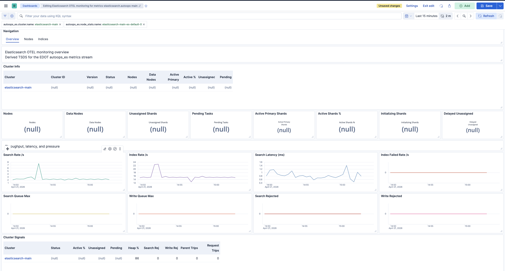
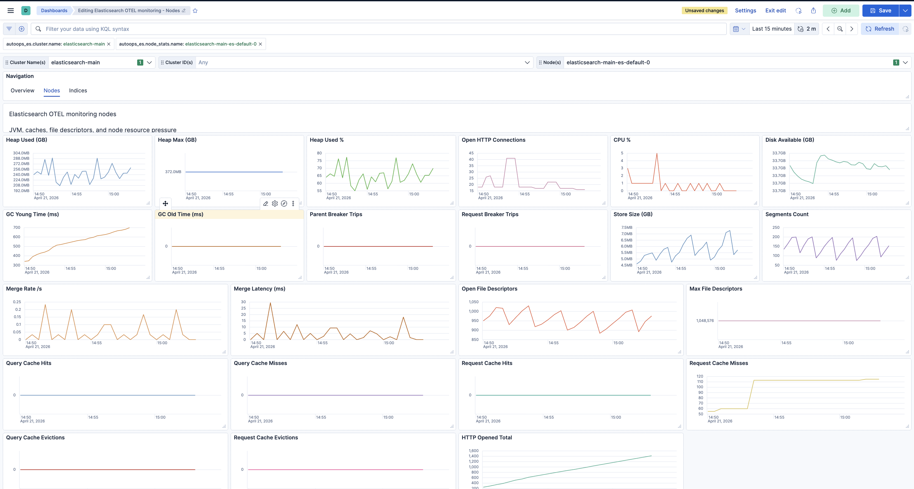
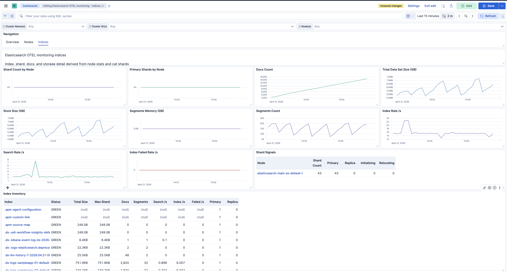

# es-otel-monitoring

This repository provisions a local `k3d` lab with two Elasticsearch clusters managed by ECK and two Elasticsearch monitoring paths:

- `autoops`
  - EDOT `autoops_es` collection
  - raw source preserved in `logs-elasticsearch.metrics-main`
  - curated TSDS derived into `metrics-elasticsearch.autoops-main`
- `agent`
  - standalone Elastic Agent running the EDOT runtime
  - Elasticsearch Stack Monitoring metrics collected through Elastic Agent inputs
  - Elasticsearch logs collected through Elastic Agent `filestream`
  - metrics shipped directly to stack-monitoring data streams in the monitoring cluster

The lab also deploys a synthetic workload so the dashboards show index and search activity immediately after deployment.

## Why This Repo Uses Elastic Agent EDOT Runtime

The goal of the `agent` path is not generic OpenTelemetry scraping of Elasticsearch. The goal is Elastic-supported collection of Elasticsearch monitoring metrics and logs with Elastic Agent and the EDOT runtime.

That distinction matters:

- Elastic Agent 9.2+ embeds the EDOT Collector runtime.
- Elastic Agent inputs and Beat receivers produce ECS-shaped Elasticsearch monitoring data.
- Elasticsearch Stack Monitoring metrics are expected to land in Elastic monitoring data streams such as `metrics-elasticsearch.stack_monitoring.*-main`.
- The upstream OpenTelemetry Collector Contrib `elasticsearchreceiver` is not part of the supported EDOT component set for this use case.

The old `contrib` path in this repo used the upstream `elasticsearchreceiver`. That manifest has been removed and replaced by the `agent` path.

Official references used for this change:

- Elastic Agent as an OpenTelemetry Collector:
  - https://www.elastic.co/docs/reference/fleet/elastic-agent-as-otel-collector
- Collecting monitoring data with Elastic Agent:
  - https://www.elastic.co/guide/en/elasticsearch/reference/current/configuring-elastic-agent.html
- Elasticsearch integration for Stack Monitoring datasets:
  - https://www.elastic.co/docs/reference/integrations/elasticsearch
- Monitoring data streams created by Elastic Agent:
  - https://www.elastic.co/guide/en/elasticsearch/reference/current/config-monitoring-data-streams-elastic-agent.html

## Topology

- `lab-main`
  - main Elasticsearch cluster
  - main Kibana
  - monitoring collectors
  - synthetic search workload
- `lab-monitoring`
  - monitoring Elasticsearch cluster
  - monitoring Kibana

High-level flow:

1. Elasticsearch in `lab-main` exposes HTTPS endpoints and pod log files.
2. The selected monitoring path collects metrics from the main cluster.
3. Elasticsearch server logs are tailed from Kubernetes nodes.
4. Monitoring data is shipped to the monitoring Elasticsearch cluster.
5. Dashboards in monitoring Kibana read from the stream for the selected mode.

## Optional: Elastic Observability Serverless (Managed OTLP)

To ship OpenTelemetry from Kubernetes to an **Elastic Observability Serverless** project via **Managed OTLP** and optionally scrape Elasticsearch with the upstream **`elasticsearchreceiver`**, use the helper scripts in this repo. That path does **not** require the local `lab-monitoring` Elasticsearch cluster. Details, environment variables, and which dashboard bundle to import are in [monitoring-modes.md](monitoring-modes.md#4-optional-elastic-serverless-managed-otlp-motel).

## Monitoring Modes

### `EDOT_MONITORING_MODE=autoops`

This is the existing lab path based on the `autoops_es` module.

Components:

- [manifests/edot/main-metrics.yaml](manifests/edot/main-metrics.yaml)
- [manifests/edot/main-logs.yaml](manifests/edot/main-logs.yaml)
- [manifests/edot/gateway.yaml](manifests/edot/gateway.yaml)
- [manifests/edot/autoops-tsds-deriver.yaml](manifests/edot/autoops-tsds-deriver.yaml)

Data flow:

- `metricbeatreceiver/elasticsearch` with `autoops_es` collects Elasticsearch monitoring payloads.
- In the current runtime that payload is emitted as logs, not native metrics.
- Raw documents land in `logs-elasticsearch.metrics-main`.
- A derivation job reads the raw source and writes curated metrics into `metrics-elasticsearch.autoops-main`.
- Elasticsearch logs land in `logs-elasticsearch.logs.otel-main`.

Benefits:

- preserves the full raw `autoops_es` payload
- keeps a debuggable source stream
- provides richer fields than the old upstream `elasticsearchreceiver` path

Tradeoffs:

- metrics first land in a `logs-*` stream
- a second derivation stage is required

### `EDOT_MONITORING_MODE=agent`

This is the preferred Elastic-supported path for Elasticsearch monitoring in this repo.

Components:

- [manifests/edot/main-metrics-agent.yaml](manifests/edot/main-metrics-agent.yaml)
- [manifests/edot/main-logs-agent.yaml](manifests/edot/main-logs-agent.yaml)

What it is:

- standalone Elastic Agent
- running the EDOT runtime
- managed locally by Kubernetes, not Fleet-managed
- using Elastic Agent inputs instead of the removed upstream `elasticsearchreceiver`

Data flow:

- `elasticsearch/metrics` input collects Elasticsearch Stack Monitoring datasets.
- `filestream` collects Elasticsearch server logs from Kubernetes container log paths.
- both inputs write directly to the monitoring Elasticsearch cluster

Current live streams created by this mode on `9.3.3`:

- `metrics-elasticsearch.stack_monitoring.cluster_stats-main`
- `metrics-elasticsearch.stack_monitoring.index-main`
- `metrics-elasticsearch.stack_monitoring.index_recovery-main`
- `metrics-elasticsearch.stack_monitoring.index_summary-main`
- `metrics-elasticsearch.stack_monitoring.node-main`
- `metrics-elasticsearch.stack_monitoring.node_stats-main`
- `metrics-elasticsearch.stack_monitoring.shard-main`
- `logs-elasticsearch.server-main`

Benefits:

- supported Elastic Agent path
- no custom derivation step
- native Stack Monitoring datasets arrive directly in the monitoring cluster
- easier alignment with Elastic monitoring templates and fields

Tradeoffs:

- only the fields exposed by the Elastic Agent Elasticsearch integration are available
- if you switch from the old contrib path on a reused lab, legacy `metrics-elasticsearch.stack_monitoring.otel-main` data can remain until manually cleaned up

Compatibility note:

- `EDOT_MONITORING_MODE=contrib` is still accepted as a backward-compatible alias in scripts
- it now resolves to the `agent` path

## Repository Layout

- `manifests/elastic`
  - ECK operator and Elasticsearch/Kibana resources
- `manifests/edot`
  - monitoring collectors, gateway, derivation job, and search workload manifests
- `manifests/opentelemetry-elasticsearch-scrape.yaml`
  - optional OpenTelemetry Operator `OpenTelemetryCollector` that scrapes **your** Elasticsearch with the contrib `elasticsearchreceiver` and forwards OTLP to the in-cluster kube-stack gateway (see [monitoring-modes.md](monitoring-modes.md#4-optional-elastic-serverless-managed-otlp-motel))
- `dashboards`
  - generated Kibana saved objects
- `docs/index.html`
  - GitHub Pages presentation
- `monitoring-modes.md`
  - deployment commands and flow comparison for `autoops`, `agent`, and `contrib`
- `scripts`
  - deployment, verification, dashboard generation, and helper scripts
  - `scripts/install_otlp_kube_stack_managed_motlp.sh` — Helm install `opentelemetry-kube-stack` with Managed OTLP export to Serverless
  - `scripts/install_elasticsearch_scrape_collector.sh` — create scrape secret and apply `opentelemetry-elasticsearch-scrape.yaml`
  - `scripts/import_dashboards_remote_kibana.sh` — import dashboard NDJSON into remote Kibana (Serverless or hosted)
- `images`
  - dashboard screenshots used in the README and presentation

## Dashboard Assets

- `stack-mon.ndjson`
  - legacy baseline export kept for reference
- [dashboards/elasticsearch-otel-monitoring-main.ndjson](dashboards/elasticsearch-otel-monitoring-main.ndjson)
  - autoops dashboard set
- [dashboards/elasticsearch-otel-monitoring-main.export.json](dashboards/elasticsearch-otel-monitoring-main.export.json)
  - structured wrapper for the autoops dashboard objects
- [dashboards/elasticsearch-otel-monitoring-agent.ndjson](dashboards/elasticsearch-otel-monitoring-agent.ndjson)
  - Elastic Agent–branded dashboard set (same OTLP Lens definitions as Contrib, remapped saved object IDs; targets `metrics-elasticsearch.stack_monitoring.otel-main`)
- [dashboards/elasticsearch-otel-monitoring-agent.export.json](dashboards/elasticsearch-otel-monitoring-agent.export.json)
  - structured wrapper for the Elastic Agent dashboard objects
- [dashboards/elasticsearch-otel-monitoring-contrib.ndjson](dashboards/elasticsearch-otel-monitoring-contrib.ndjson)
  - optional OpenTelemetry contrib `elasticsearchreceiver` dashboard set (for example Managed OTLP into `metrics-elasticsearch.stack_monitoring.otel-main`)
- [dashboards/elasticsearch-otel-monitoring-contrib.export.json](dashboards/elasticsearch-otel-monitoring-contrib.export.json)
  - structured wrapper for the contrib dashboard objects
- [scripts/build_otel_dashboard_ndjson.py](scripts/build_otel_dashboard_ndjson.py)
  - regenerates the autoops dashboards
- [scripts/build_otel_agent_dashboard_ndjson.py](scripts/build_otel_agent_dashboard_ndjson.py)
  - regenerates the Elastic Agent–branded dashboards from the Contrib builder (MoTel / `otel-main` compatible)
- [scripts/build_otel_contrib_dashboard_ndjson.py](scripts/build_otel_contrib_dashboard_ndjson.py)
  - regenerates the optional contrib dashboards
- [scripts/import_monitoring_dashboard.sh](scripts/import_monitoring_dashboard.sh)
  - imports the dashboard set for the selected mode

The **Elastic Agent** NDJSON is generated from the same Contrib OTLP definitions (`elasticsearchreceiver` → `metrics-elasticsearch.stack_monitoring.otel-main`) with different saved object IDs and titles so **Elasticsearch monitoring - Elastic Agent overview** works on Managed OTLP–only projects. The **Contrib** bundle is the same data with OTEL-branded names. For classic Integration metrics (`cluster_stats`, `node_stats`, …) without OTLP, use dashboards built for those schemas. Remote import: [scripts/import_dashboards_remote_kibana.sh](scripts/import_dashboards_remote_kibana.sh).

## Dashboard Views

Overview:



Nodes:



Indices:



Both dashboard sets are split into three linked pages:

- overview
- nodes
- indices

Every page keeps the same top filter controls so cluster and node filters survive navigation.

## Kubernetes Secrets And Credentials

Collector pods do not hardcode Elasticsearch credentials in their manifests. They read credentials from Kubernetes Secrets created during deployment.

Secrets created by [scripts/deploy_edot.sh](scripts/deploy_edot.sh):

- `lab-main/edot-root-ca`
- `lab-monitoring/edot-root-ca`
- `lab-main/edot-main-source-credentials`
- `lab-main/edot-monitoring-credentials`
- `lab-monitoring/edot-monitoring-credentials`
- `lab-main/main-search-load-credentials`
- `lab-monitoring/edot-autoops-tsds-credentials`
  - autoops mode only

Generated users and required permissions:

- source cluster monitoring reader
  - user: `edot_metrics_reader`
  - role: built-in `remote_monitoring_collector`
- monitoring cluster ingest writer
  - user: `edot_ingest_writer`
  - cluster privileges: `monitor`
  - index privileges on `logs-*` and `metrics-*`:
    - `auto_configure`
    - `create_doc`
    - `view_index_metadata`
- autoops TSDS deriver
  - autoops mode only
  - read from `logs-elasticsearch.metrics-main`
  - write to `metrics-elasticsearch.autoops-main`
- synthetic workload writer
  - writes and searches the sample `logsdb` streams in the main cluster

## How The Metrics And Logs Flow

### Autoops mode

1. `metricbeatreceiver/elasticsearch` collects `autoops_es`.
2. raw monitoring events are stored in `logs-elasticsearch.metrics-main`.
3. `filelog` stores Elasticsearch server logs in `logs-elasticsearch.logs.otel-main`.
4. the deriver rewrites curated metrics into `metrics-elasticsearch.autoops-main`.
5. dashboards read the derived TSDS.

### Agent mode

1. standalone Elastic Agent starts with local `agent.yml`.
2. `elasticsearch/metrics` collects Stack Monitoring datasets from the main cluster.
3. `filestream` reads Elasticsearch pod logs from `/var/log/containers`.
4. Elastic Agent writes directly to the monitoring Elasticsearch cluster.
5. metrics land in `metrics-elasticsearch.stack_monitoring.*-main`.
6. logs land in `logs-elasticsearch.server-main`.
7. dashboards read the stack-monitoring metrics streams directly.

## Synthetic Workload

The synthetic workload exists so the dashboards show read and write activity without manual traffic generation.

Defaults:

- five `logsdb` data streams
- `75` writes per cycle
- `6` searches per cycle
- `1` shard
- `0` replicas

Important lifecycle behavior:

- `make search-load-up`
  - deploys or updates the workload
- `make search-load-down`
  - stops the workload
  - deletes the generated sample data streams
  - deletes the custom sample template
- `make search-load-reset`
  - deletes the sample data streams and template without changing the deployment target

## Quick Start

```bash
make help
make up
make test
```

Examples:

```bash
make up EDOT_MONITORING_MODE=autoops
make up EDOT_MONITORING_MODE=agent
make up ES_VERSION=9.3.3 EDOT_MONITORING_MODE=agent
make search-load-up SEARCH_LOAD_NUMBER_OF_SHARDS=2 SEARCH_LOAD_NUMBER_OF_REPLICAS=1
```

## Deployment Flow

`make up` performs:

1. create the local `k3d` cluster
2. install ingress-nginx
3. install cert-manager
4. install ECK
5. deploy the main and monitoring Elasticsearch/Kibana stacks
6. create monitoring users and Kubernetes Secrets
7. deploy the selected monitoring mode
8. deploy the synthetic workload
9. import the dashboard set for the selected mode when the stack version supports it

Agent mode specifics:

- the old upstream `elasticsearchreceiver` manifest is no longer deployed
- the monitoring gateway is deleted if it exists from an earlier mode
- metrics and logs ship directly from `lab-main` to the monitoring cluster

## Validation

Primary validation command:

```bash
make test EDOT_MONITORING_MODE=agent
```

What [scripts/test_auth.sh](scripts/test_auth.sh) checks:

- TLS certificates are ready
- both Kibana ingresses answer
- main Elasticsearch authentication works
- monitoring data streams exist
- metrics are present for the selected mode
- logs are present for the selected mode
- the synthetic workload streams contain documents
- the workload deployment is ready
- the selected dashboard exists in Kibana

Live validation completed for `EDOT_MONITORING_MODE=agent` on April 30, 2026:

- Elastic Agent metrics deployment rolled successfully
- Elastic Agent logs DaemonSet rolled successfully
- `elasticsearch/metrics` input reached `HEALTHY`
- `filestream` input reached `HEALTHY`
- monitoring metrics streams were created under `metrics-elasticsearch.stack_monitoring.*-main`
- monitoring logs were present in `logs-elasticsearch.server-main`
- `bash ./scripts/test_auth.sh` passed in `agent` mode

## Troubleshooting

- metrics pod starts but the input fails
  - check `kubectl -n lab-main logs deploy/edot-main-metrics`
  - the most important signal is the Elastic Agent component state for `elasticsearch/metrics-default`
- logs DaemonSet is not ready
  - check `kubectl -n lab-main logs ds/edot-main-logs`
  - verify `/var/log/containers` is mounted and readable
- dashboards are empty after mode switching
  - confirm the selected dashboard matches the mode
  - confirm data streams for the selected mode exist
  - on reused labs, exclude or delete legacy streams from previous modes if they cause confusion
- `autoops` mode does not produce metrics directly
  - this is expected in the current runtime
  - use the derived TSDS, not the raw source stream, for dashboards
- dashboard import fails through Kibana ingress
  - this repo already sets `nginx.ingress.kubernetes.io/proxy-body-size: "50m"`

Useful commands:

```bash
kubectl -n lab-main get deploy,ds,pods
kubectl -n lab-main logs deploy/edot-main-metrics --tail=200
kubectl -n lab-main logs ds/edot-main-logs --tail=200
kubectl -n lab-monitoring get pods
```

## Migration Note

Migration from the old upstream `elasticsearchreceiver` **as the default in-lab** path to Elastic Agent EDOT runtime:

- removed from the default `make up` lab:
  - `manifests/edot/main-metrics-contrib.yaml` (collector now Elastic Agent manifests)
- **Optional (restored)** for Serverless Managed OTLP and other OTLP sinks that still use `elasticsearchreceiver`:
  - [manifests/opentelemetry-elasticsearch-scrape.yaml](manifests/opentelemetry-elasticsearch-scrape.yaml)
  - [scripts/build_otel_contrib_dashboard_ndjson.py](scripts/build_otel_contrib_dashboard_ndjson.py)
  - contrib dashboard NDJSON / export under `dashboards/`
- added:
  - standalone Elastic Agent metrics manifest
  - standalone Elastic Agent logs manifest
  - new Elastic Agent dashboard set
- changed:
  - `EDOT_MONITORING_MODE=agent` is now the supported replacement for the old contrib mode
  - `EDOT_MONITORING_MODE=contrib` remains as a compatibility alias

Behavioral change:

- old contrib path:
  - upstream OTel Contrib `elasticsearchreceiver`
  - OTel-native metrics stream `metrics-elasticsearch.stack_monitoring.otel-main`
- new agent path:
  - standalone Elastic Agent
  - EDOT runtime
  - Elastic Agent `elasticsearch/metrics` input
  - stack-monitoring metrics streams under `metrics-elasticsearch.stack_monitoring.*-main`

## Presentation

The repo presentation is published through GitHub Pages at:

- [docs/index.html](docs/index.html)

It now needs to be read as:

- `autoops` for raw-source-plus-derivation
- `agent` for Elastic Agent EDOT runtime collection

## Notes

- `EDOT_MONITORING_MODE=agent` is the preferred supported path.
- `EDOT_MONITORING_MODE=autoops` remains useful when the raw `autoops_es` payload is required.
- The old contrib mode is deprecated and only kept as a script alias for compatibility.
