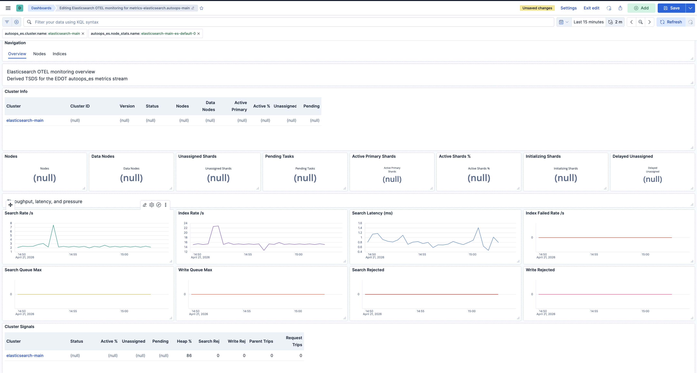
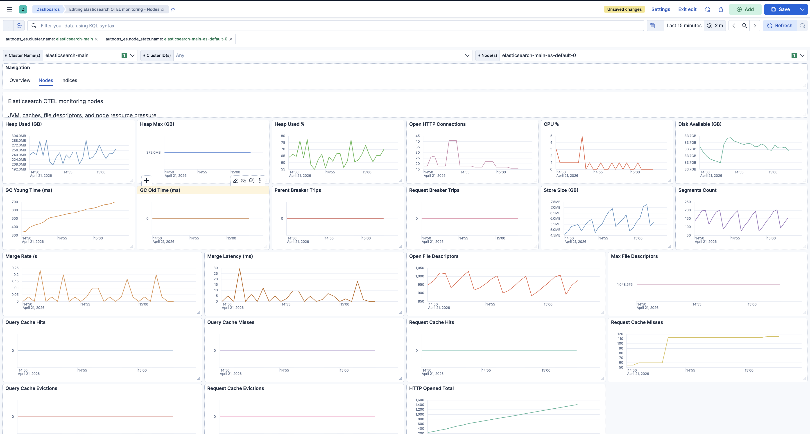
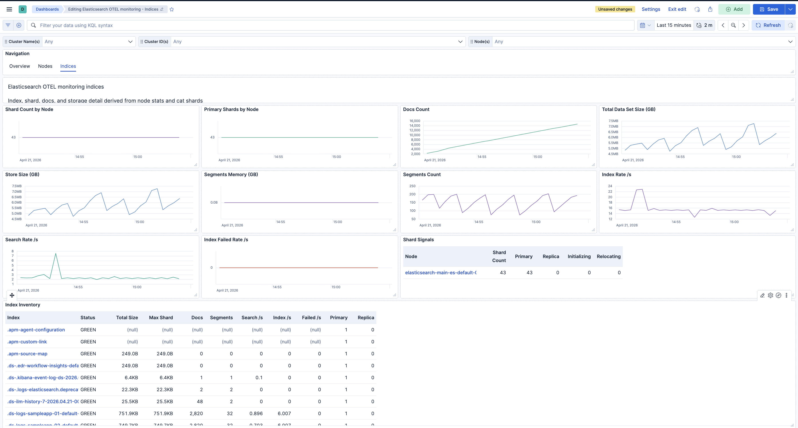

# es-otel-monitoring

This repository provisions a local `k3d` lab with two Elasticsearch clusters managed by ECK and four Elasticsearch monitoring paths:

- `autoops`
  - EDOT `autoops_es` collection
  - raw source preserved in `logs-elasticsearch.metrics-main`
  - curated TSDS derived into `metrics-elasticsearch.autoops-main`
- `agent`
  - standalone Elastic Agent running the EDOT runtime
  - Elasticsearch Stack Monitoring metrics collected through Elastic Agent inputs
  - Elasticsearch logs collected through Elastic Agent `filestream`
  - metrics shipped directly to stack-monitoring data streams in the monitoring cluster
- `agent-jwt`
  - JWT-authenticated Elastic Agent EDOT runtime containers
  - local JWT-backed source proxy plus a native OTLP metrics exporter sidecar
  - OTLP-native metrics and logs shipped through `edot-gateway`
- `contrib`
  - upstream OpenTelemetry Collector Contrib receiver path
  - Elasticsearch metrics collected through the contrib receiver
  - Elasticsearch logs collected through the shared logs path
  - metrics shipped to the direct stack-monitoring-style contrib data stream

The lab also deploys a synthetic workload so the dashboards show index and search activity immediately after deployment.

## Why This Repo Uses Elastic Agent EDOT Runtime

The goal of the `agent` path is not generic OpenTelemetry scraping of Elasticsearch. The goal is Elastic-supported collection of Elasticsearch monitoring metrics and logs with Elastic Agent and the EDOT runtime.

The repo keeps all four paths intentionally:

- `autoops` for raw `autoops_es` collection plus derivation
- `agent` for the supported Elastic Agent stack-monitoring path
- `agent-jwt` for an isolated JWT-authenticated EDOT workflow
- `contrib` for the upstream collector-contrib comparison path

That distinction matters:

- Elastic Agent 9.2+ embeds the EDOT Collector runtime.
- Elastic Agent inputs and Beat receivers produce ECS-shaped Elasticsearch monitoring data.
- Elasticsearch Stack Monitoring metrics are expected to land in Elastic monitoring data streams such as `metrics-elasticsearch.stack_monitoring.*-main`.
- The upstream OpenTelemetry Collector Contrib `elasticsearchreceiver` is not part of the supported EDOT component set for this use case.
- The isolated JWT flow uses a separate EDOT path and does not share the standard `agent` collectors.
- The JWT path now emits native OTLP metrics from a local exporter sidecar and forwards them through the Elastic Agent EDOT runtime.

The `contrib` path in this repo uses the upstream `elasticsearchreceiver` and is kept as a separate comparison path alongside the Agent and JWT workflows.

Official references used for this change:

- Elastic Agent as an OpenTelemetry Collector:
  - https://www.elastic.co/docs/reference/fleet/elastic-agent-as-otel-collector
- Collecting monitoring data with Elastic Agent:
  - https://www.elastic.co/guide/en/elasticsearch/reference/current/configuring-elastic-agent.html
- Elasticsearch integration for Stack Monitoring datasets:
  - https://www.elastic.co/docs/reference/integrations/elasticsearch
- Monitoring data streams created by Elastic Agent:
  - https://www.elastic.co/guide/en/elasticsearch/reference/current/config-monitoring-data-streams-elastic-agent.html

## Topology

- `lab-main`
  - main Elasticsearch cluster
  - main Kibana
  - monitoring collectors
  - synthetic search workload
- `lab-monitoring`
  - monitoring Elasticsearch cluster
  - monitoring Kibana

High-level flow:

1. Elasticsearch in `lab-main` exposes HTTPS endpoints and pod log files.
2. The selected monitoring path collects metrics from the main cluster.
3. Elasticsearch server logs are tailed from Kubernetes nodes.
4. Monitoring data is shipped to the monitoring Elasticsearch cluster.
5. Dashboards in monitoring Kibana read from the stream for the selected mode.

## Monitoring Modes

### `EDOT_MONITORING_MODE=autoops`

This is the existing lab path based on the `autoops_es` module.

Components:

- [manifests/edot/main-metrics.yaml](manifests/edot/main-metrics.yaml)
- [manifests/edot/main-logs.yaml](manifests/edot/main-logs.yaml)
- [manifests/edot/gateway.yaml](manifests/edot/gateway.yaml)
- [manifests/edot/autoops-tsds-deriver.yaml](manifests/edot/autoops-tsds-deriver.yaml)

Data flow:

- `metricbeatreceiver/elasticsearch` with `autoops_es` collects Elasticsearch monitoring payloads.
- In the current runtime that payload is emitted as logs, not native metrics.
- Raw documents land in `logs-elasticsearch.metrics-main`.
- A derivation job reads the raw source and writes curated metrics into `metrics-elasticsearch.autoops-main`.
- Elasticsearch logs land in `logs-elasticsearch.logs.otel-main`.

Benefits:

- preserves the full raw `autoops_es` payload
- keeps a debuggable source stream
- provides richer fields than the old upstream `elasticsearchreceiver` path

Tradeoffs:

- metrics first land in a `logs-*` stream
- a second derivation stage is required

### `EDOT_MONITORING_MODE=agent`

This is the preferred Elastic-supported path for Elasticsearch monitoring in this repo.

Components:

- [manifests/edot/main-metrics-agent.yaml](manifests/edot/main-metrics-agent.yaml)
- [manifests/edot/main-logs-agent.yaml](manifests/edot/main-logs-agent.yaml)

What it is:

- standalone Elastic Agent
- running the EDOT runtime
- managed locally by Kubernetes, not Fleet-managed
- using Elastic Agent inputs instead of the removed upstream `elasticsearchreceiver`

Data flow:

- `elasticsearch/metrics` input collects Elasticsearch Stack Monitoring datasets.
- `filestream` collects Elasticsearch server logs from Kubernetes container log paths.
- both inputs write directly to the monitoring Elasticsearch cluster

Current live streams created by this mode on `9.3.3`:

- `metrics-elasticsearch.stack_monitoring.cluster_stats-main`
- `metrics-elasticsearch.stack_monitoring.index-main`
- `metrics-elasticsearch.stack_monitoring.index_recovery-main`
- `metrics-elasticsearch.stack_monitoring.index_summary-main`
- `metrics-elasticsearch.stack_monitoring.node-main`
- `metrics-elasticsearch.stack_monitoring.node_stats-main`
- `metrics-elasticsearch.stack_monitoring.shard-main`
- `logs-elasticsearch.server-main`

Benefits:

- supported Elastic Agent path
- no custom derivation step
- native Stack Monitoring datasets arrive directly in the monitoring cluster
- easier alignment with Elastic monitoring templates and fields

Tradeoffs:

- only the fields exposed by the Elastic Agent Elasticsearch integration are available
- if you reuse a lab after running `contrib`, legacy `metrics-elasticsearch.stack_monitoring.otel-main` data can remain until manually cleaned up

Compatibility note:

- `EDOT_MONITORING_MODE=agent-jwt` is the isolated JWT-authenticated EDOT path.
- `EDOT_MONITORING_MODE=contrib` remains available as the collector-contrib comparison path.

## Repository Layout

- `manifests/elastic`
  - ECK operator and Elasticsearch/Kibana resources
- `manifests/edot`
  - monitoring collectors, gateway, derivation job, and search workload manifests
- `dashboards`
  - generated Kibana saved objects
- `docs/index.html`
  - GitHub Pages presentation
- `monitoring-modes.md`
  - deployment commands and flow comparison for `autoops`, `agent`, and `contrib`
- `agent-otel-jwt.md`
  - JWT setup and config flow
- `scripts`
  - deployment, verification, dashboard generation, and helper scripts
- `images`
  - dashboard screenshots used in the README and presentation

## Dashboard Assets

- `stack-mon.ndjson`
  - legacy baseline export kept for reference
- [dashboards/elasticsearch-otel-monitoring-main.ndjson](dashboards/elasticsearch-otel-monitoring-main.ndjson)
  - autoops dashboard set
- [dashboards/elasticsearch-otel-monitoring-main.export.json](dashboards/elasticsearch-otel-monitoring-main.export.json)
  - structured wrapper for the autoops dashboard objects
- [dashboards/elasticsearch-otel-monitoring-agent.ndjson](dashboards/elasticsearch-otel-monitoring-agent.ndjson)
  - Elastic Agent dashboard set
- [dashboards/elasticsearch-otel-monitoring-agent.export.json](dashboards/elasticsearch-otel-monitoring-agent.export.json)
  - structured wrapper for the Elastic Agent dashboard objects
- [dashboards/elasticsearch-otel-monitoring-contrib.ndjson](dashboards/elasticsearch-otel-monitoring-contrib.ndjson)
  - upstream contrib dashboard set
- [dashboards/elasticsearch-otel-monitoring-contrib.export.json](dashboards/elasticsearch-otel-monitoring-contrib.export.json)
  - structured wrapper for the contrib dashboard objects
- [dashboards/elasticsearch-otel-monitoring-jwt.ndjson](dashboards/elasticsearch-otel-monitoring-jwt.ndjson)
  - JWT OTLP dashboard set
- [dashboards/elasticsearch-otel-monitoring-jwt.export.json](dashboards/elasticsearch-otel-monitoring-jwt.export.json)
  - structured wrapper for the JWT dashboard objects
- [scripts/build_otel_dashboard_ndjson.py](scripts/build_otel_dashboard_ndjson.py)
  - regenerates the autoops dashboards
- [scripts/build_otel_agent_dashboard_ndjson.py](scripts/build_otel_agent_dashboard_ndjson.py)
  - regenerates the Elastic Agent dashboards
- [scripts/build_otel_contrib_dashboard_ndjson.py](scripts/build_otel_contrib_dashboard_ndjson.py)
  - regenerates the contrib dashboards
- [scripts/build_otel_jwt_dashboard_ndjson.py](scripts/build_otel_jwt_dashboard_ndjson.py)
  - regenerates the JWT OTLP dashboards
- [scripts/import_monitoring_dashboard.sh](scripts/import_monitoring_dashboard.sh)
  - imports the dashboard set for the selected mode
- [scripts/import_jwt_dashboard.sh](scripts/import_jwt_dashboard.sh)
  - imports the JWT dashboard set

The Elastic Agent dashboard data view intentionally excludes the legacy `metrics-elasticsearch.stack_monitoring.otel-main` stream so a reused lab does not mix old upstream-receiver data with the new Agent data.

The JWT dashboard is separate again and reads the OTLP metrics stream directly,
so it can be used without touching the standard Agent dashboard objects. The
saved objects target the native OTLP metrics stream produced by the JWT
workflow. The JWT setup also keeps its own logs collector and OTLP gateway path
separate from the normal `agent` run.

JWT setup details, config sections, authentication flow, data-shape notes, and
sampling guidance live in [agent-otel-jwt.md](agent-otel-jwt.md).
The JWT source-cluster overlay relies on the ECK trial-license secret being
applied before the clusters are created; if the source cluster is left on
`basic`, the exporter will return 401s.

## Dashboard Views

Overview:



Nodes:



Indices:



Both dashboard sets are split into three linked pages:

- overview
- nodes
- indices

Every page keeps the same top filter controls so cluster and node filters survive navigation.

## Kubernetes Secrets And Credentials

Collector pods do not hardcode Elasticsearch credentials in their manifests. They read credentials from Kubernetes Secrets created during deployment.

Secrets created by [scripts/deploy_edot.sh](scripts/deploy_edot.sh):

- `lab-main/edot-root-ca`
- `lab-monitoring/edot-root-ca`
- `lab-main/edot-main-source-credentials`
- `lab-main/edot-monitoring-credentials`
- `lab-monitoring/edot-monitoring-credentials`
- `lab-main/main-search-load-credentials`
- `lab-monitoring/edot-autoops-tsds-credentials`
  - autoops mode only

Generated users and required permissions:

- source cluster monitoring reader
  - user: `edot_metrics_reader`
  - role: built-in `remote_monitoring_collector`
- monitoring cluster ingest writer
  - user: `edot_ingest_writer`
  - cluster privileges: `monitor`
  - index privileges on `logs-*` and `metrics-*`:
    - `auto_configure`
    - `create_doc`
    - `view_index_metadata`
- autoops TSDS deriver
  - autoops mode only
  - read from `logs-elasticsearch.metrics-main`
  - write to `metrics-elasticsearch.autoops-main`
- synthetic workload writer
  - writes and searches the sample `logsdb` streams in the main cluster

## How The Metrics And Logs Flow

### Autoops mode

1. `metricbeatreceiver/elasticsearch` collects `autoops_es`.
2. raw monitoring events are stored in `logs-elasticsearch.metrics-main`.
3. `filelog` stores Elasticsearch server logs in `logs-elasticsearch.logs.otel-main`.
4. the deriver rewrites curated metrics into `metrics-elasticsearch.autoops-main`.
5. dashboards read the derived TSDS.

### Agent mode

1. standalone Elastic Agent starts with local `agent.yml`.
2. `elasticsearch/metrics` collects Stack Monitoring datasets from the main cluster.
3. `filestream` reads Elasticsearch pod logs from `/var/log/containers`.
4. Elastic Agent writes directly to the monitoring Elasticsearch cluster.
5. metrics land in `metrics-elasticsearch.stack_monitoring.*-main`.
6. logs land in `logs-elasticsearch.server-main`.
7. dashboards read the stack-monitoring metrics streams directly.

### Contrib mode

1. the contrib receiver scrapes Elasticsearch directly.
2. metrics are written through the shared OTLP gateway path.
3. logs continue to land in `logs-elasticsearch.logs.otel-main`.
4. metrics land in `metrics-elasticsearch.stack_monitoring.otel-main`.
5. dashboards read the contrib metrics stream directly.

## Synthetic Workload

The synthetic workload exists so the dashboards show read and write activity without manual traffic generation.

Defaults:

- five `logsdb` data streams
- `75` writes per cycle
- `6` searches per cycle
- `1` shard
- `0` replicas

Important lifecycle behavior:

- `make search-load-up`
  - deploys or updates the workload
- `make search-load-down`
  - stops the workload
  - deletes the generated sample data streams
  - deletes the custom sample template
- `make search-load-reset`
  - deletes the sample data streams and template without changing the deployment target

## Quick Start

```bash
make help
make up
make test
```

Examples:

```bash
make up EDOT_MONITORING_MODE=autoops
make up EDOT_MONITORING_MODE=agent
make up EDOT_MONITORING_MODE=contrib
make up ES_VERSION=9.3.3 EDOT_MONITORING_MODE=agent
make search-load-up SEARCH_LOAD_NUMBER_OF_SHARDS=2 SEARCH_LOAD_NUMBER_OF_REPLICAS=1
```

## Deployment Flow

`make up` performs:

1. create the local `k3d` cluster
2. install ingress-nginx
3. install cert-manager
4. install ECK
5. create the ECK trial-license secret in `elastic-system`
6. deploy the main and monitoring Elasticsearch/Kibana stacks
7. create monitoring users and Kubernetes Secrets
8. deploy the selected monitoring mode
9. deploy the synthetic workload
10. import the dashboard set for the selected mode when the stack version supports it

Mode-specific behavior:

- `autoops`
  - deploys the EDOT collector, gateway, and deriver
  - keeps the raw source stream and derived TSDS
- `agent`
  - deploys Elastic Agent metrics and logs manifests
  - deletes the gateway and deriver from earlier modes
  - ships directly to stack-monitoring data streams
- `contrib`
  - deploys the restored contrib receiver manifest and the shared gateway
  - keeps the direct contrib metrics stream
  - does not use the autoops deriver
- `agent-jwt`
  - relies on the ECK trial-license secret so JWT realms are available on fresh installs
  - deploys the isolated JWT OTLP workflow after the main cluster comes up
  - fails fast if the source cluster cannot enable JWT realms

## Validation

Primary validation command:

```bash
make test EDOT_MONITORING_MODE=agent
```

What [scripts/test_auth.sh](scripts/test_auth.sh) checks:

- TLS certificates are ready
- both Kibana ingresses answer
- main Elasticsearch authentication works
- monitoring data streams exist
- metrics are present for the selected mode
- logs are present for the selected mode
- the synthetic workload streams contain documents
- the workload deployment is ready
- the selected dashboard exists in Kibana

Live validation completed for `EDOT_MONITORING_MODE=agent` on April 30, 2026:

- Elastic Agent metrics deployment rolled successfully
- Elastic Agent logs DaemonSet rolled successfully
- `elasticsearch/metrics` input reached `HEALTHY`
- `filestream` input reached `HEALTHY`
- monitoring metrics streams were created under `metrics-elasticsearch.stack_monitoring.*-main`
- monitoring logs were present in `logs-elasticsearch.server-main`
- `bash ./scripts/test_auth.sh` passed in `agent` mode

## Troubleshooting

- metrics pod starts but the input fails
  - check `kubectl -n lab-main logs deploy/edot-main-metrics`
  - the most important signal is the Elastic Agent component state for `elasticsearch/metrics-default`
- logs DaemonSet is not ready
  - check `kubectl -n lab-main logs ds/edot-main-logs`
  - verify `/var/log/containers` is mounted and readable
- dashboards are empty after mode switching
  - confirm the selected dashboard matches the mode
  - confirm data streams for the selected mode exist
  - on reused labs, exclude or delete legacy streams from previous modes if they cause confusion
- `autoops` mode does not produce metrics directly
  - this is expected in the current runtime
  - use the derived TSDS, not the raw source stream, for dashboards
- dashboard import fails through Kibana ingress
  - this repo already sets `nginx.ingress.kubernetes.io/proxy-body-size: "50m"`

Useful commands:

```bash
kubectl -n lab-main get deploy,ds,pods
kubectl -n lab-main logs deploy/edot-main-metrics --tail=200
kubectl -n lab-main logs ds/edot-main-logs --tail=200
kubectl -n lab-monitoring get pods
```

## Mode Comparison

The four modes differ by where collection starts and where the first durable data lands:

- `autoops`
  - upstream `autoops_es` payload
  - raw documents land in a logs-shaped source stream
  - a deriver turns the source into a curated TSDS
- `agent`
  - Elastic Agent with EDOT runtime
  - Elasticsearch integration metrics and `filestream` logs
  - data lands directly in Elastic monitoring data streams
- `agent-jwt`
  - JWT-authenticated Elastic Agent EDOT runtime
  - pod-local auth proxy injects JWT and client-auth headers for Elasticsearch
  - native OTLP metrics are emitted by a local exporter sidecar and shipped through `edot-gateway`
  - logs are shipped separately through `edot-gateway`
  - data lands in dedicated OTLP monitoring streams
- `contrib`
  - upstream OpenTelemetry Collector Contrib Elasticsearch receiver
  - metrics are forwarded through the shared gateway
  - direct contrib metrics stream stays separate from the Agent stream

## Presentation

The repo presentation is published through GitHub Pages at:

- [docs/index.html](docs/index.html)

It now needs to be read as:

- `autoops` for raw-source-plus-derivation
- `agent` for Elastic Agent EDOT runtime collection
- `agent-jwt` for the isolated JWT-authenticated EDOT path
- `contrib` for the upstream collector-contrib comparison path

## Notes

- `EDOT_MONITORING_MODE=autoops` remains useful when the raw `autoops_es`
  payload is required.
- `EDOT_MONITORING_MODE=agent` is the Elastic-supported Stack Monitoring path.
- `EDOT_MONITORING_MODE=agent-jwt` is the isolated JWT-authenticated EDOT path with native OTLP metrics.
- `EDOT_MONITORING_MODE=contrib` remains available as the upstream
  collector-contrib comparison path.
- JWT setup details are documented in [agent-otel-jwt.md](agent-otel-jwt.md).
